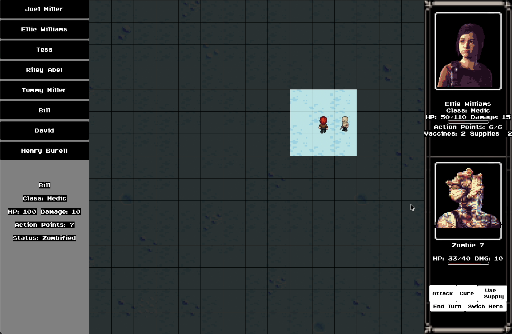

# The Last of Us 2D

## Description
This is a 2D implementation of the popular game "The Last of Us", created by Mohamad Rageh, Omar Riad, and Marwan Salah. Java and JavaFX have been used to build the game.
Our implementation of "The Last of Us" is a 2D version of the original game. We created this game as a project for CSEN401 Course.

## Table of Contents
- [Installation](#installation)
- [Gameplay](#gameplay)
- [Screenshots](#screenshots)
- [Features](#features)
- [Conclusion](#conclusion)
- [Awards](#awards)
- [Resources](#resources)

## Installation
Simply download the files and run the Java program. Make sure you have Java and JavaFX installed on your computer before running the program.
A more detailed installation Guide and Jar version of the game will be added soon will be updated soon.

## Gameplay

## Screenshots

*Main Menu*

*Choosing a Starting Charchter menu*

*Game Map*

## Features
- 2D graphics
- Engaging Gameplay, Music and Sound Effects 
- Various challenges
- Hidden treasures and collectibles
- Various enemy types and obstacles

### Some of In-Game Charachters and Items

Vaccine / Supply / Zombie / Riely

## Conclusion
We had a lot of fun creating this 2D version of "The Last of Us", and we hope you enjoy playing it as much as we enjoyed building it. Thank you for checking out our project!

## Awards
We're proud to say that Our game is one of the top 7 teams in our university chosen by professors of the Course. 

## Resources

[LinkedIn Post about the Game with a video of the Gameplay](https://www.linkedin.com/posts/marawan-abdelrahman_im-happy-to-share-that-our-team-consisting-activity-7086398397804351489-Sg04?utm_source=share&utm_medium=member_desktop)

[JavaFx Installation Guide on Eclipse (Youtube Video)](https://www.youtube.com/watch?v=nz8P528uGjk)
